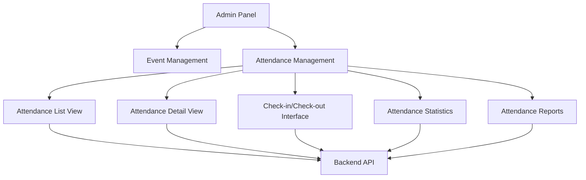
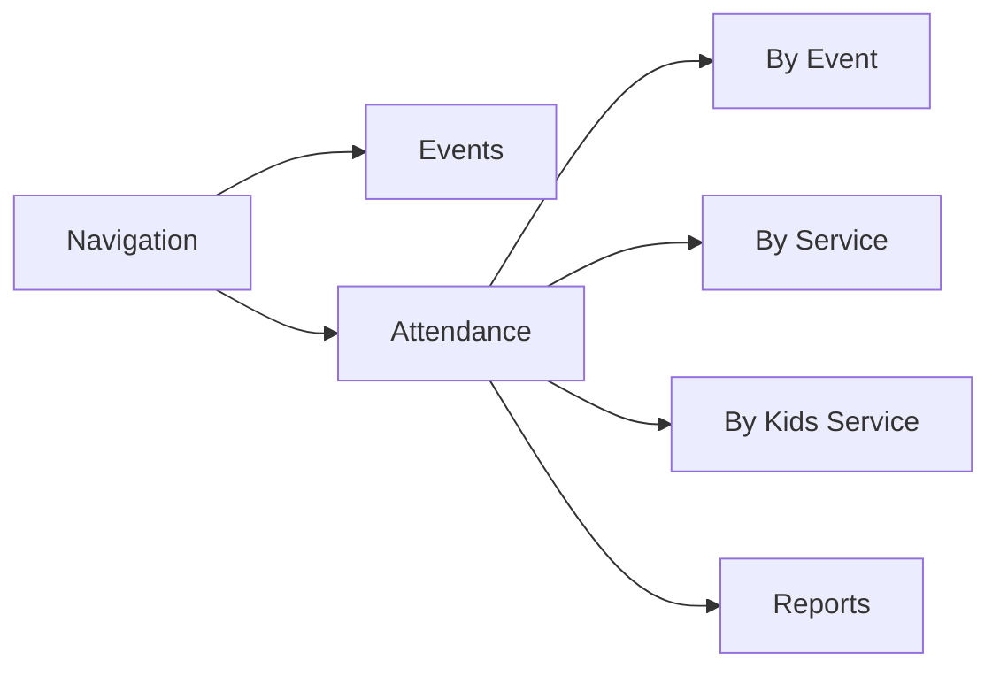

# Design Document: Event Attendance Management

## Overview

The Event Attendance Management feature will extend the existing Svelte admin panel to provide comprehensive attendance tracking capabilities. This feature will integrate with the backend attendance API to enable administrators to view, manage, and analyze attendance data for events, services, and kids services. The design focuses on creating an intuitive, efficient interface that supports quick attendance operations while providing detailed insights through statistics and visualizations.

## Architecture

The Event Attendance Management feature will follow the existing architecture of the Svelte admin panel, which uses a component-based approach with SvelteKit for routing and state management. The feature will integrate with the existing backend API endpoints for attendance management.

### High-Level Architecture



### Data Flow

1. User navigates to the Attendance Management section
2. System loads attendance data from the backend API
3. User interacts with attendance records (view, check-in/out, update status)
4. System sends updates to the backend API
5. Backend processes the updates and returns confirmation
6. UI updates to reflect the changes

## Components and Interfaces

### 1. Attendance Navigation Component

This component will extend the existing navigation to include attendance management options.



### 2. Attendance List Component

Displays a list of attendance records with filtering and sorting options.

**Props:**
- `eventType`: Type of event (EVENT, SERVICE, KIDS_SERVICE)
- `eventId`: ID of the specific event
- `attendanceRecords`: Array of attendance records
- `onCheckIn`: Function to handle check-in
- `onCheckOut`: Function to handle check-out
- `onUpdateStatus`: Function to handle status updates

**State:**
- `filteredRecords`: Filtered attendance records
- `sortField`: Current sort field
- `sortDirection`: Current sort direction
- `filterStatus`: Current filter status

### 3. Attendance Detail Component

Displays detailed information about a specific attendance record.

**Props:**
- `attendance`: Attendance record object
- `onUpdate`: Function to handle updates
- `onDelete`: Function to handle deletion

**State:**
- `isEditing`: Boolean indicating edit mode
- `updatedAttendance`: Copy of attendance record for editing

### 4. Check-in/Check-out Component

Provides interface for checking in or out attendees.

**Props:**
- `eventType`: Type of event
- `eventId`: ID of the specific event
- `onCheckIn`: Function to handle check-in
- `onCheckOut`: Function to handle check-out

**State:**
- `selectedUser`: Currently selected user for check-in/out
- `notes`: Notes for the attendance record

### 5. Attendance Statistics Component

Displays statistics and visualizations for attendance data.

**Props:**
- `eventType`: Type of event
- `eventId`: ID of the specific event
- `stats`: Attendance statistics object

**State:**
- `chartType`: Type of chart to display
- `dateRange`: Date range for statistics

## Data Models

### Attendance View Model

```typescript
interface AttendanceViewModel {
  id: number;
  eventType: 'EVENT' | 'SERVICE' | 'KIDS_SERVICE';
  eventId: number;
  eventName: string;
  attendeeId: number;
  attendeeName: string;
  attendeeType: 'USER' | 'KID';
  checkedInBy: {
    id: number;
    name: string;
  };
  checkInTime: string;
  checkOutTime: string | null;
  checkedOutBy: {
    id: number;
    name: string;
  } | null;
  status: 'CHECKED_IN' | 'CHECKED_OUT' | 'EMERGENCY' | 'NO_SHOW';
  notes: string;
  createdAt: string;
}
```

### Attendance Statistics Model

```typescript
interface AttendanceStats {
  totalAttendees: number;
  currentlyCheckedIn: number;
  checkedOut: number;
  noShows: number;
  emergencies: number;
  checkInRate: number; // Percentage of expected attendees who checked in
  averageDuration: number; // Average time spent (in minutes)
}
```

### API Interface Extensions

The following API endpoints will be used:

```typescript
// Add to existing API endpoints
const ENDPOINTS = {
  // ... existing endpoints
  
  // Attendance endpoints
  ATTENDANCE_BY_EVENT: (eventId) => `/attendance/event/${eventId}`,
  ATTENDANCE_BY_SERVICE: (serviceId) => `/attendance/service/${serviceId}`,
  ATTENDANCE_BY_KIDS_SERVICE: (kidsServiceId) => `/attendance/kids-service/${kidsServiceId}`,
  ATTENDANCE_CHECK_IN: (eventType, id) => `/attendance/${eventType.toLowerCase()}/${id}/check-in`,
  ATTENDANCE_CHECK_OUT: '/attendance/check-out',
  ATTENDANCE_UPDATE_STATUS: '/attendance/status',
  ATTENDANCE_UPDATE_NOTES: '/attendance/notes',
  ATTENDANCE_STATS: (eventType, id) => `/attendance/${eventType.toLowerCase()}/${id}/stats`,
};
```

## Error Handling

1. **Network Errors**: Display appropriate error messages when API calls fail
2. **Validation Errors**: Validate input data before sending to the API
3. **Concurrency Issues**: Handle cases where multiple admins might be updating the same records
4. **Loading States**: Show loading indicators during API operations

## Testing Strategy

### Unit Tests

1. Test individual components in isolation
2. Verify component rendering with different props
3. Test state changes and user interactions

### Integration Tests

1. Test the interaction between components
2. Verify data flow from API to components and back
3. Test navigation between different views

### End-to-End Tests

1. Test complete user flows (e.g., navigating to attendance view, checking in a user)
2. Verify that changes persist after page reloads
3. Test error handling and edge cases

## UI Design

### Attendance List View

The attendance list view will display attendance records in a table format with the following columns:
- Attendee Name
- Check-in Time
- Check-out Time
- Status
- Actions (Check-out, Edit, etc.)

Filters will be provided for:
- Status (CHECKED_IN, CHECKED_OUT, EMERGENCY, NO_SHOW)
- Date Range
- Attendee Type (User/Kid)

### Attendance Detail View

The attendance detail view will show:
- Attendee information
- Event information
- Check-in/out details
- Status history
- Notes
- Actions (Update status, Edit notes)

### Check-in/Check-out Interface

The check-in/check-out interface will provide:
- Search for users/kids
- Quick check-in/out buttons
- Notes field
- Confirmation dialog

### Statistics Dashboard

The statistics dashboard will include:
- Summary cards with key metrics
- Charts showing attendance trends
- Filters for date ranges and event types

## Implementation Considerations

1. **Performance**: Optimize API calls and data loading to handle large numbers of attendance records
2. **Responsiveness**: Ensure the interface works well on both desktop and mobile devices
3. **Offline Support**: Consider implementing offline capabilities for check-in/out operations
4. **Real-time Updates**: Explore options for real-time updates when multiple admins are working simultaneously
5. **Accessibility**: Ensure the interface is accessible to users with disabilities

## Security Considerations

1. **Authentication**: Ensure all attendance operations require proper authentication
2. **Authorization**: Verify that users have appropriate permissions for attendance management
3. **Data Protection**: Handle attendee data in compliance with privacy regulations
4. **Audit Trail**: Maintain logs of all attendance-related actions for accountability