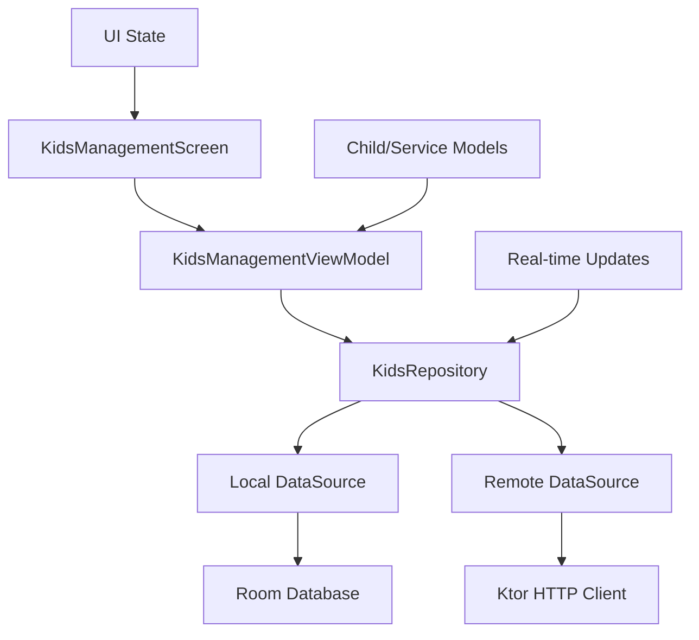

# Kids Management Feature Design Document

## Overview

The Kids Management feature will be implemented as a comprehensive module within the existing Kotlin Multiplatform Hillsong app architecture. It will provide parents and church staff with tools to register children, view available kids services, and manage check-in/check-out operations for children attending church programs and activities.

The feature follows the established app architecture with clean separation of concerns using MVVM pattern, Compose Multiplatform for UI, Koin for dependency injection, and Room for local data persistence with real-time synchronization for check-in/check-out operations.

## Architecture

### Module Structure

```
feature/kids/
├── src/commonMain/kotlin/rfm/hillsongptapp/feature/kids/
│   ├── data/
│   │   ├── repository/
│   │   ├── datasource/
│   │   └── model/
│   ├── domain/
│   │   ├── usecase/
│   │   └── model/
│   ├── ui/
│   │   ├── screens/
│   │   ├── components/
│   │   └── theme/
│   └── di/
└── build.gradle.kts
```

### Navigation Integration

The kids management feature integrates with the existing navigation system through the `HomeNav.KidsScreen` route, providing seamless navigation from the main app into the kids management section.

### Data Flow Architecture



## Components and Interfaces

### Core Data Models

#### Child Models

```kotlin
@Serializable
data class Child(
    val id: String,
    val parentId: String,
    val name: String,
    val dateOfBirth: String,
    val medicalInfo: String? = null,
    val dietaryRestrictions: String? = null,
    val emergencyContact: EmergencyContact,
    val status: CheckInStatus,
    val currentServiceId: String? = null,
    val checkInTime: String? = null,
    val checkOutTime: String? = null,
    val createdAt: String,
    val updatedAt: String
)

@Serializable
data class EmergencyContact(
    val name: String,
    val phoneNumber: String,
    val relationship: String
)

enum class CheckInStatus {
    CHECKED_OUT, CHECKED_IN, NOT_IN_SERVICE
}
```

#### Service Models

```kotlin
@Serializable
data class KidsService(
    val id: String,
    val name: String,
    val description: String,
    val minAge: Int,
    val maxAge: Int,
    val startTime: String,
    val endTime: String,
    val location: String,
    val maxCapacity: Int,
    val currentCapacity: Int,
    val isAcceptingCheckIns: Boolean,
    val staffMembers: List<String>,
    val createdAt: String
)
```

#### Check-in/Check-out Models

```kotlin
@Serializable
data class CheckInRecord(
    val id: String,
    val childId: String,
    val serviceId: String,
    val checkInTime: String,
    val checkOutTime: String? = null,
    val checkedInBy: String,
    val checkedOutBy: String? = null,
    val notes: String? = null,
    val status: CheckInStatus
)
```

### Repository Layer

#### KidsRepository Interface

```kotlin
interface KidsRepository {
    // Child Management
    suspend fun getChildrenForParent(parentId: String): Result<List<Child>>
    suspend fun registerChild(child: Child): Result<Child>
    suspend fun updateChild(child: Child): Result<Child>
    suspend fun deleteChild(childId: String): Result<Unit>

    // Service Management
    suspend fun getAvailableServices(): Result<List<KidsService>>
    suspend fun getServicesForAge(age: Int): Result<List<KidsService>>
    suspend fun getServiceById(serviceId: String): Result<KidsService>

    // Check-in/Check-out Operations
    suspend fun checkInChild(childId: String, serviceId: String): Result<CheckInRecord>
    suspend fun checkOutChild(childId: String): Result<CheckInRecord>
    suspend fun getCheckInHistory(childId: String): Result<List<CheckInRecord>>
    suspend fun getCurrentCheckIns(serviceId: String): Result<List<CheckInRecord>>

    // Staff/Reporting
    suspend fun getServiceReport(serviceId: String): Result<ServiceReport>
    suspend fun getAllCurrentCheckIns(): Result<List<CheckInRecord>>
}
```

### UI Components

#### Screen Components

- **KidsManagementScreen**: Main dashboard showing registered children and their status
- **ChildRegistrationScreen**: Form for registering new children
- **ChildEditScreen**: Form for editing existing child information
- **ServicesScreen**: List of available kids services with details
- **CheckInScreen**: Interface for checking children into services
- **CheckOutScreen**: Interface for checking children out of services
- **ReportsScreen**: Staff view for service attendance and capacity management

#### Reusable UI Components

- **ChildCard**: Displays child information with status indicators
- **ServiceCard**: Shows service details, capacity, and availability
- **StatusIndicator**: Visual indicator for check-in/check-out status
- **CheckInButton**: Action button for check-in operations
- **CheckOutButton**: Action button for check-out operations
- **CapacityIndicator**: Shows current vs maximum capacity for services

### ViewModels

#### KidsManagementViewModel

```kotlin
class KidsManagementViewModel(
    private val kidsRepository: KidsRepository,
    private val userRepository: UserRepository
) : ViewModel() {

    private val _uiState = MutableStateFlow(KidsManagementUiState())
    val uiState: StateFlow<KidsManagementUiState> = _uiState.asStateFlow()

    fun loadChildren()
    fun loadAvailableServices()
    fun checkInChild(childId: String, serviceId: String)
    fun checkOutChild(childId: String)
    fun registerNewChild(child: Child)
    fun updateChildInfo(child: Child)
    fun refreshData()
}

data class KidsManagementUiState(
    val children: List<Child> = emptyList(),
    val services: List<KidsService> = emptyList(),
    val isLoading: Boolean = false,
    val error: String? = null,
    val selectedChild: Child? = null
)
```

## Data Models

### Local Database Schema (Room)

#### ChildEntity

```kotlin
@Entity(tableName = "children")
data class ChildEntity(
    @PrimaryKey val id: String,
    val parentId: String,
    val name: String,
    val dateOfBirth: String,
    val medicalInfo: String?,
    val dietaryRestrictions: String?,
    val emergencyContactName: String,
    val emergencyContactPhone: String,
    val emergencyContactRelationship: String,
    val status: String,
    val currentServiceId: String?,
    val checkInTime: String?,
    val checkOutTime: String?,
    val createdAt: String,
    val updatedAt: String,
    val lastSyncedAt: String
)
```

#### KidsServiceEntity

```kotlin
@Entity(tableName = "kids_services")
data class KidsServiceEntity(
    @PrimaryKey val id: String,
    val name: String,
    val description: String,
    val minAge: Int,
    val maxAge: Int,
    val startTime: String,
    val endTime: String,
    val location: String,
    val maxCapacity: Int,
    val currentCapacity: Int,
    val isAcceptingCheckIns: Boolean,
    val staffMembers: String, // JSON serialized list
    val createdAt: String,
    val lastSyncedAt: String
)
```

#### CheckInRecordEntity

```kotlin
@Entity(tableName = "checkin_records")
data class CheckInRecordEntity(
    @PrimaryKey val id: String,
    val childId: String,
    val serviceId: String,
    val checkInTime: String,
    val checkOutTime: String?,
    val checkedInBy: String,
    val checkedOutBy: String?,
    val notes: String?,
    val status: String,
    val lastSyncedAt: String
)
```

### API Response Models

#### ChildrenResponse

```kotlin
@Serializable
data class ChildrenResponse(
    val children: List<ChildDto>,
    val pagination: PaginationDto
)

@Serializable
data class ChildDto(
    val id: String,
    val parentId: String,
    val name: String,
    val dateOfBirth: String,
    val medicalInfo: String?,
    val dietaryRestrictions: String?,
    val emergencyContact: EmergencyContactDto,
    val status: String,
    val currentServiceId: String?,
    val checkInTime: String?,
    val checkOutTime: String?,
    val createdAt: String,
    val updatedAt: String
)

@Serializable
data class ServicesResponse(
    val services: List<KidsServiceDto>
)

@Serializable
data class CheckInResponse(
    val record: CheckInRecordDto,
    val updatedChild: ChildDto,
    val updatedService: KidsServiceDto
)
```

## Error Handling

### Error Types

```kotlin
sealed class KidsManagementError : Exception() {
    object NetworkError : KidsManagementError()
    object ChildNotFound : KidsManagementError()
    object ServiceNotFound : KidsManagementError()
    object ServiceAtCapacity : KidsManagementError()
    object ChildAlreadyCheckedIn : KidsManagementError()
    object ChildNotCheckedIn : KidsManagementError()
    object InvalidAgeForService : KidsManagementError()
    object RegistrationFailed : KidsManagementError()
    data class ValidationError(val field: String, val message: String) : KidsManagementError()
    data class UnknownError(val message: String) : KidsManagementError()
}
```

### Error Handling Strategy

- Network errors: Show cached data and retry mechanisms with offline indicators
- Check-in errors: Clear error messages with suggested actions (e.g., "Service is full, try another service")
- Validation errors: Real-time form validation with helpful error messages
- Service capacity errors: Show alternative services or waitlist options
- Sync conflicts: Automatic conflict resolution with user notification for critical conflicts

## Testing Strategy

### Unit Testing

- **Repository Tests**: Mock data sources and test child/service management logic
- **ViewModel Tests**: Test state management and check-in/check-out operations
- **Use Case Tests**: Validate business rules for registration, check-ins, and capacity management
- **Model Tests**: Test data serialization, validation, and age calculations

### Integration Testing

- **Database Tests**: Test Room database operations, migrations, and real-time sync
- **Network Tests**: Test API integration with mock servers for check-in operations
- **Navigation Tests**: Test screen transitions and deep linking to specific children/services

### UI Testing

- **Compose Tests**: Test UI components and user interactions for management operations
- **Screenshot Tests**: Ensure consistent visual appearance across platforms
- **Accessibility Tests**: Verify accessibility for parents and staff users

### Platform-Specific Testing

- **Android Tests**: Test Android-specific features and permissions
- **iOS Tests**: Test iOS-specific features and native integrations
- **Common Tests**: Test shared business logic across platforms

### Business Logic Testing

- **Capacity Management Tests**: Ensure services don't exceed maximum capacity
- **Age Validation Tests**: Verify children can only be checked into age-appropriate services
- **Check-in/Check-out Flow Tests**: Test complete workflows and edge cases
- **Data Consistency Tests**: Ensure data integrity during concurrent operations

## Security and Privacy Considerations

### Data Protection

- Secure storage of children's personal information with encryption at rest
- Minimal data collection - only information necessary for safety and service delivery
- Encrypted communication for all API calls, especially check-in/check-out operations
- Compliance with child privacy regulations (COPPA, GDPR for minors)

### Access Control

- Parent/guardian verification before child registration
- Role-based access for staff members (check-in permissions, reporting access)
- Secure authentication for sensitive operations (check-out verification)
- Audit logging for all check-in/check-out activities

### Data Integrity

- Real-time synchronization to prevent double check-ins
- Conflict resolution for concurrent operations
- Backup and recovery procedures for critical child safety data
- Data validation to prevent invalid states (child checked into multiple services)

## Performance Considerations

### Real-time Operations

- Efficient WebSocket connections for real-time check-in/check-out updates
- Optimized database queries for large numbers of children and services
- Caching strategies for frequently accessed data (service lists, child information)
- Background synchronization to keep local data current

### Scalability

- Pagination for large lists of children and check-in records
- Efficient search and filtering for finding specific children or services
- Database indexing on frequently queried fields (parent ID, service ID, check-in status)
- Connection pooling for concurrent check-in operations

### Platform Optimization

- Android: Optimize for various screen sizes and device capabilities
- iOS: Leverage native UI patterns for familiar user experience
- Shared: Efficient Compose UI with minimal recomposition for status updates
- Offline capability: Local storage for critical operations when network is unavailable

### Additional Considerations

#### ServiceReport Model

```kotlin
@Serializable
data class ServiceReport(
    val serviceId: String,
    val serviceName: String,
    val totalCapacity: Int,
    val currentCheckIns: Int,
    val availableSpots: Int,
    val checkedInChildren: List<Child>,
    val staffMembers: List<String>,
    val generatedAt: String
)
```
